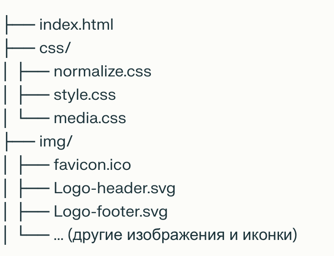

# Евклид — Сайт проектной компании

## О проекте

**Евклид** — сайт компании, реализующей проектные решения любой сложности. Проект выполнен с использованием HTML и CSS, включает адаптивную верстку, современный дизайн и интерактивные элементы. Сайт содержит информацию о компании, этапах работы, часто задаваемых вопросах и форму для отправки заявки.

---

## Содержание

- [О проекте](#о-проекте)
- [Функционал](#функционал)
- [Технологии](#технологии)
- [Как запустить проект](#как-запустить-проект)
- [Структура проекта](#структура-проекта)
- [Контакты и ссылки](#контакты-и-ссылки)
- [Лицензия](#лицензия)
- [Скриншоты](#скриншоты)

---

## Функционал

- Главная страница с промо-блоком и кнопкой "Заказать расчёт"
- Раздел "О нас" с подробным описанием компании и преимуществами
- Блок "Этапы" с описанием этапов работы и кнопками для подробностей и договора
- Раздел "Вопросы" с часто задаваемыми вопросами и ответами
- Форма для отправки заявки (ФИО, email, сообщение, согласие на обработку данных)
- Навигационное меню и футер с дополнительными ссылками и социальными сетями
- Адаптивная верстка для корректного отображения на мобильных и десктопных устройствах

---

## Технологии

- **HTML5** — семантическая разметка страниц  
- **CSS3** — стилизация, адаптивность  
- **SVG** — иконки и логотипы  
- **normalize.css** — сброс стандартных стилей  
- **media.css** — стили для адаптивности

---

## Как запустить проект

1. Скачайте или клонируйте репозиторий.
2. Откройте файл `index.html` в браузере.
3. Убедитесь, что папки `css/` и `img/` находятся рядом с HTML-файлом.

---

## Структура проекта

---

## Контакты и ссылки

- **Социальные сети:**  
  - Одноклассники  
  - ВКонтакте
- **Форма обратной связи:** доступна в футере сайта

---