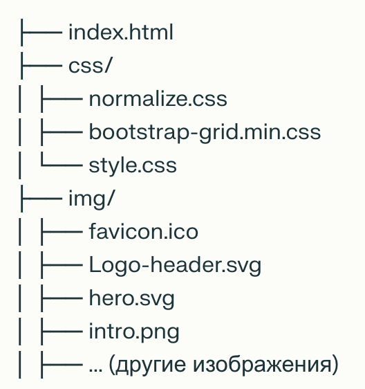

# Курсы 3D моделирования — Skillbox

## О проекте

Сайт представляет собой лендинг образовательной платформы Skillbox, посвящённый онлайн-курсам по 3D-моделированию. Проект реализован с использованием HTML и CSS, с адаптивной вёрсткой и современным дизайном. На сайте представлены ключевые разделы: информация о курсах, преподавателях, преимуществах обучения и контактные данные.

---

## Содержание

- [О проекте](#о-проекте)
- [Функционал](#функционал)
- [Технологии](#технологии)
- [Как запустить проект](#как-запустить-проект)
- [Структура проекта](#структура-проекта)
- [Авторы](#авторы)
- [Лицензия](#лицензия)
- [Скриншоты](#скриншоты)

---

## Функционал

- Главная страница с промо-блоком и кнопкой выбора курса
- Раздел "О нас" с преимуществами обучения
- Блок с преподавателями (фото, имена, описание)
- Каталог курсов с описанием, длительностью и кнопкой "Подробнее"
- Адаптивная вёрстка для мобильных и десктопных устройств
- Навигационное меню и футер с социальными ссылками

---

## Технологии

- **HTML5** — семантическая разметка страниц  
- **CSS3** — стилизация, адаптивность  
- **Bootstrap Grid** — сетка для вёрстки  
- **SVG/PNG** — иконки и изображения  
- **Normalize.css** — сброс стилей

---

## Как запустить проект

1. Скачайте или клонируйте репозиторий.
2. Откройте файл `index.html` в браузере.
3. Убедитесь, что папки `css/` и `img/` находятся рядом с HTML-файлом.

---

## Структура проекта

---

## Авторы

- Skillbox, 2023  
- Дизайн и структура сайта вдохновлены современными образовательными платформами.

---

## Лицензия

Информация на сайте носит справочный характер и не является публичной офертой.

---
